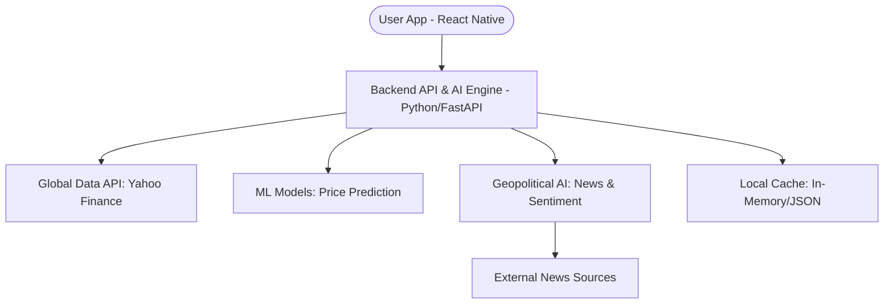

# AI-Driven Global Stock Tracker & Predictor - Architecture

## System Overview
A lightweight, high-performance system designed for global market tracking and AI-powered outcome prediction. It uses a consolidated Python backend for both API and AI logic, ensuring maximum efficiency and data-science integration.

## Component Diagram

## Tech Stack
- **Frontend**: React Native (Dashboard).
- **Backend**: Python (FastAPI) - Handles both API and AI.
- **AI/ML**: Scikit-Learn, TensorFlow/PyTorch, Pandas-TA.
- **LLM**: Gemini/OpenAI (for News & Geopolitics).
- **Data Source**: `yfinance` (Stock Data), `newsapi` (News Data).

## Data Flow
1. **Live Tracking**: Frontend requests live price for a ticker -> Backend checks Redis cache -> If not found/stale, fetches from External API -> Updates Redis -> Returns to Frontend.
2. **Signals**: Backend periodically fetches historical data -> Calculates RSI/MA -> Generates Buy/Sell signals based on predefined thresholds -> (Phase 3) Pushes to WebSocket.

## Why this architecture?
- **Scalability**: Decoupling the data fetching from the API allows for easier rate-limit management.
- **Performance**: Redis caching ensures the app feels fast and responsive.
- **Cross-Platform**: React Native ensures the same codebase works on iOS and Android.
